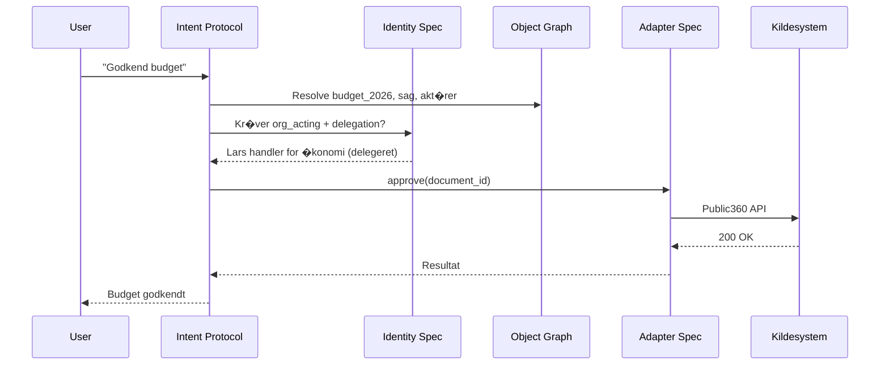

# EIRA Open Architecture v1.0

**Status:** G�ldende � platformvision  
**Dato:** 26. juni 2026  
**Projekt:** EIRA (EIRA OS + �kosystem)

---

## 1. Kernebeslutning

EIRA pr�senteres **ikke prim�rt som et produkt**, men som et **�bent arkitekturframework** med officielle specifikationer, som leverand�rer, kommuner og udviklere kan implementere uafh�ngigt af EIRA OS desktop.

> **EIRA Open Architecture** � fire �bne specifikationer. EIRA OS er referenceimplementeringen.

---

## 2. Hvorfor �bne standarder?

| Kun produkt | �bent �kosystem |
|-------------|-----------------|
| EIRA bygger alle adaptere | KMD, Visma, SAP bygger �n adapter hver |
| Lock-in til EIRA desktop | Andre klienter kan bruge samme Intent Protocol |
| Salg til slutbruger | Salg til platform + certificering |
| Konkurrence med Windows | Komplement�r infrastrukturlag |

**Platformspotentialet opst�r n�r standarderne st�r alene** � som HTTP, OAuth eller Matrix.

---

## 3. De fire officielle specifikationer

```
???????????????????????????????????????????????????????????????????
?                    EIRA OPEN ARCHITECTURE                        ?
???????????????????????????????????????????????????????????????????
?                                                                  ?
?  ????????????????  ????????????????  ????????????????           ?
?  ?   INTENT     ?  ?   IDENTITY   ?  ?    OBJECT    ?           ?
?  ?   PROTOCOL   ?  ? SPECIFICATION?  ?    GRAPH     ?           ?
?  ?              ?  ?              ?  ?              ?           ?
?  ? Hvad vil     ?  ? Hvem handler ?  ? Hvad findes  ?           ?
?  ? brugeren?    ?  ? med hvilken  ?  ? i verden?    ?           ?
?  ?              ?  ? tillid?      ?  ? (relationer) ?           ?
?  ????????????????  ????????????????  ????????????????           ?
?         ?                 ?                 ?                    ?
?         ?????????????????????????????????????                    ?
?                           ?                                      ?
?                  ????????????????                                ?
?                  ?   ADAPTER    ?  + Capability Declaration      ?
?                  ? SPECIFICATION?                                ?
?                  ?              ?                                ?
?                  ? Hvordan      ?                                ?
?                  ? kobles vi    ?                                ?
?                  ? til systemer??                                ?
?                  ????????????????                                ?
?                         ?                                        ?
?              SharePoint � Public360 � KMD � SAP � Matrix         ?
???????????????????????????????????????????????????????????????????
```

| # | Specifikation | Sp�rgsm�l den besvarer | Referenceimplementering |
|---|---------------|----------------------|-------------------------|
| **1** | [EIRA Adapter Specification](EIRA_Adapter_Specification_v1.0.docx) | Hvordan integreres et kildesystem? | `eira-adapter-sdk` |
| **2** | [EIRA Identity Specification](EIRA_Identity_Specification_v0.1.md) | Hvem handler, med hvilken tillid og delegation? | `eira-identity-core` |
| **3** | [EIRA Intent Protocol](EIRA_Intent_Protocol_v1.1.md) | Hvad �nsker brugeren at opn�? | `eira-intent-engine` |
| **4** | [EIRA Object Graph Specification](EIRA_Object_Graph_Specification_v0.2.md) | Hvilke entiteter og relationer findes? | SQLite cache i EIRA OS |

**Capability Standard** (hvad kan et system?) er en **deklaration inden for Adapter Specification** � ikke en femte spec, men et obligatorisk capability manifest per adapter.

---

## 4. Specifikationernes relation



---

## 5. Implementeringsniveauer (certificering)

Hver specifikation definerer conformance-niveauer � som Adapter Standard (CORE / STANDARD / PREMIUM):

| Niveau | Adapter | Identity | Intent | Object Graph |
|--------|---------|----------|--------|--------------|
| **CORE** | L�s, s�g | Session + OIDC | Parse + confidence | Objekter + relationer |
| **STANDARD** | Skriv, godkend | Step-up + audit | Execute med policy | FTS + sync |
| **PREMIUM** | Webhooks, realtime | EUDI + delegation | Multi-step flows | Federeret graf |

**EIRA Certified** � uafh�ngig test suite per spec (som EIRA Adapter Test Suite v1.0).

---

## 6. Hvem implementerer hvad?

| Akt�r | Typisk implementering |
|-------|----------------------|
| **EIRA (os)** | Referenceimplementering af alle fire |
| **KMD, Visma, SAP** | Adapter Specification |
| **Kommune IT** | Identity + policies (Entra, MitID Erhverv) |
| **Tredjeparts-klient** | Intent Protocol + Object Graph (uden EIRA desktop) |
| **Wallet-udbyder** | Identity Specification (OID4VP verifier side) |
| **Udbud (KL/KOMBIT)** | Krav om EIRA Adapter minimum STANDARD |

---

## 7. Governance af standarderne

| Element | Ansvar |
|---------|--------|
| Spec-versionering | Semver (v1.0, v1.1, v2.0) |
| Breaking changes | 12 m�neders overlapperiode |
| Reference docs | `spec@eira.os` |
| Test suites | Open source (GitHub) |
| Certification body | EIRA eller neutral tredjepart (langsigt) |
| Country extensions | `dk-pack`, `de-pack` under Identity Spec |

---

## 8. EIRA OS' rolle i �kosystemet

EIRA OS er **ikke** den eneste klient. Det er den **komplette referencestack**:

```
EIRA OS = Lag 0 Governance
        + Runtime (Pr�sentation ? � ? Adaptere)
        + alle fire specifikationer implementeret
```

Andre kan bygge:
- Kun en Intent-klient mod eksisterende adaptere
- En mobil wallet der taler Identity Spec
- En kommunal gateway der kun implementerer Adapter + Capability

---

## 9. Dokumenthierarki

```
EIRA_Open_Architecture_v1.0.md          ? dette dokument (master)
??? EIRA_Adapter_Specification_v1.0.docx
??? EIRA_Identity_Specification_v0.1.md
??? EIRA_Intent_Protocol_v1.1.md
??? EIRA_Object_Graph_Specification_v0.2.md
??? EIRA_Intent_Protocol_v0.1.md          ? forrige
??? EIRA_Object_Graph_Specification_v0.1.md ? forrige
??? EIRA_Identity_Strategy_v0.2.md      ? strategi (forud for spec)
??? EIRA_OS_Architecture_Overview_v1.0.md
??? EIRA_Cognitive_Runtime_v1.0.md      ? runtime evolution (v7)
??? EIRA_Enterprise_IT_Requirements_v0.1.md
```

---

## 10. Positionering

| Til publikum | Budskab |
|--------------|---------|
| **Kommune (indk�b)** | "Krav EIRA Adapter STANDARD i udbud" |
| **Leverand�r (KMD)** | "�n adapter � alle EIRA-kunder" |
| **IT-chef** | "EIRA OS er certificeret referenceimplementering" |
| **EU / eIDAS** | "Identity Spec er OID4VP/OIDC-kompatibel" |
| **Investor** | "Platform � ikke kun desktop-licens" |

---

*EIRA Open Architecture v1.0 � Fortroligt udviklingsdokument*
